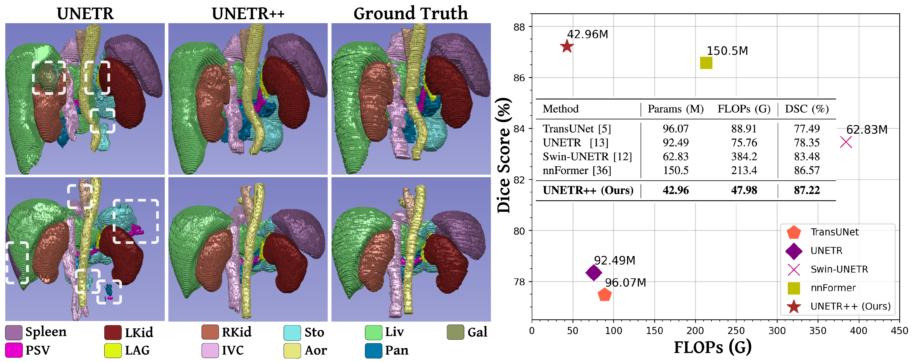

# UNETR++: Delving into Efficient and Accurate 3D Medical Image Segmentation

[Abdelrahman Shaker](https://scholar.google.com/citations?hl=en&user=eEz4Wu4AAAAJ)<sup>*1</sup>, [Muhammad Maaz](https://scholar.google.com/citations?user=vTy9Te8AAAAJ&hl=en&authuser=1&oi=sra)<sup>1</sup>, [Hanoona Rasheed](https://scholar.google.com/citations?user=yhDdEuEAAAAJ&hl=en&authuser=1&oi=sra)<sup>1</sup>, [Salman Khan](https://salman-h-khan.github.io/)<sup>1</sup>, [Ming-Hsuan Yang](https://scholar.google.com/citations?user=p9-ohHsAAAAJ&hl=en)<sup>2,3</sup> and [Fahad Shahbaz Khan](https://scholar.google.es/citations?user=zvaeYnUAAAAJ&hl=en)<sup>1,4</sup>

Mohamed Bin Zayed University of Artificial Intelligence<sup>1</sup>, University of California Merced<sup>2</sup>, Google Research<sup>3</sup>, Linkoping University<sup>4</sup>

[](https://ieeexplore.ieee.org/document/10526382)
[](https://amshaker.github.io/unetr_plus_plus/)
[](https://docs.google.com/presentation/d/e/2PACX-1vRtrxSfA2kU1fBmPxBdMQioLfsvjcjWBoaOVf3aupqajm0mw_C4TEz05Yk4ZF_vqoMyA8iiUJE60ynm/pub?start=true&loop=false&delayms=10000)


## :rocket: News
* **(May 04, 2024):** We're thrilled to share that UNETR++ has been accepted to IEEE TMI-2024! 🎊.
* **(Jun 01, 2023):** UNETR++ code & weights are released for Decathlon-Lung and BRaTs.
* **(Dec 15, 2022):** UNETR++ weights are released for Synapse & ACDC datasets.
* **(Dec 09, 2022):** UNETR++ training and evaluation codes are released.

<hr />


> **Abstract:** *Owing to the success of transformer models, recent works study their applicability in 3D medical segmentation tasks. Within the transformer models, the self-attention mechanism is one of the main building blocks that strives to capture long-range dependencies. However, the self-attention operation has quadratic complexity which proves to be a computational bottleneck, especially in volumetric medical imaging, where the inputs are 3D with numerous slices.  In this paper, we propose a 3D medical image segmentation approach, named UNETR++, that offers both high-quality segmentation masks as well as efficiency in terms of parameters, compute cost, and inference speed. The core of our design is the introduction of a novel efficient paired attention (EPA) block that efficiently learns spatial and channel-wise discriminative features using a pair of inter-dependent branches based on spatial and channel attention.
Our spatial attention formulation is efficient having linear complexity with respect to the input sequence length. To enable communication between spatial and channel-focused branches, we share the weights of query and key mapping functions that provide a complimentary benefit (paired attention), while also reducing the overall network parameters. Our extensive evaluations on five benchmarks, Synapse, BTCV, ACDC, BRaTs, and Decathlon-Lung, reveal the effectiveness of our contributions in terms of both efficiency and accuracy. On Synapse, our UNETR++ sets a new state-of-the-art with a Dice Score of 87.2%, while being significantly efficient with a reduction of over 71% in terms of both parameters and FLOPs, compared to the best method in the literature.* 
<hr />


## Architecture overview of UNETR++
Overview of our UNETR++ approach with hierarchical encoder-decoder structure. The 3D patches are fed to the encoder, whose outputs are then connected to the decoder via skip connections followed by convolutional blocks to produce the final segmentation mask. The focus of our design is the introduction of an _efficient paired-attention_ (EPA) block. Each EPA block performs two tasks using parallel attention modules with shared keys-queries and different value layers to efficiently learn enriched spatial-channel feature representations. As illustrated in the EPA block diagram (on the right), the first (top) attention module aggregates the spatial features by a weighted sum of the projected features in a linear manner to compute the spatial attention maps, while the second (bottom) attention module emphasizes the dependencies in the channels and computes the channel attention maps. Finally, the outputs of the two attention modules are fused and passed to convolutional blocks to enhance the feature representation, leading to better segmentation masks.


<hr />


## Results

### Synapse Dataset
State-of-the-art comparison on the abdominal multi-organ Synapse dataset. We report both the segmentation performance (DSC, HD95) and model complexity (parameters and FLOPs).
Our proposed UNETR++ achieves favorable segmentation performance against existing methods, while being considerably reducing the model complexity. Best results are in bold. 
Abbreviations stand for: Spl: _spleen_, RKid: _right kidney_, LKid: _left kidney_, Gal: _gallbladder_, Liv: _liver_, Sto: _stomach_, Aor: _aorta_, Pan: _pancreas_. 
Best results are in bold.


<hr />

## Qualitative Comparison

### Synapse Dataset
Qualitative comparison on multi-organ segmentation task. Here, we compare our UNETR++ with existing methods: UNETR, Swin UNETR, and nnFormer. 
The different abdominal organs are shown in the legend below the examples. Existing methods struggle to correctly segment different organs (marked in red dashed box). 
Our UNETR++ achieves promising segmentation performance by accurately segmenting the organs.


### ACDC Dataset
Qualitative comparison on the ACDC dataset. We compare our UNETR++ with existing methods: UNETR and nnFormer. It is noticeable that the existing methods struggle to correctly segment different organs (marked in red dashed box). Our UNETR++ achieves favorable segmentation performance by accurately segmenting the organs.  Our UNETR++ achieves promising segmentation performance by accurately segmenting the organs.


<hr />

## Installation
The code is tested with PyTorch 1.11.0 and CUDA 11.3. After cloning the repository, follow the below steps for installation,

1. Create and activate conda environment
```shell
conda create --name unetr_pp python=3.8
conda activate unetr_pp
```
2. Install PyTorch and torchvision
```shell
pip install torch==1.11.0+cu113 torchvision==0.12.0+cu113 --extra-index-url https://download.pytorch.org/whl/cu113
```
3. Install other dependencies
```shell
pip install -r requirements.txt
```
<hr />


## Dataset
We follow the same dataset preprocessing as in [nnFormer](https://github.com/282857341/nnFormer). We conducted extensive experiments on five benchmarks: Synapse, BTCV, ACDC, BRaTs, and Decathlon-Lung. 

The dataset folders for Synapse should be organized as follows: 

```
./DATASET_Synapse/
  ├── unetr_pp_raw/
      ├── unetr_pp_raw_data/
           ├── Task02_Synapse/
              ├── imagesTr/
              ├── imagesTs/
              ├── labelsTr/
              ├── labelsTs/
              ├── dataset.json
           ├── Task002_Synapse
       ├── unetr_pp_cropped_data/
           ├── Task002_Synapse
 ```
 
 The dataset folders for ACDC should be organized as follows: 

```
./DATASET_Acdc/
  ├── unetr_pp_raw/
      ├── unetr_pp_raw_data/
           ├── Task01_ACDC/
              ├── imagesTr/
              ├── imagesTs/
              ├── labelsTr/
              ├── labelsTs/
              ├── dataset.json
           ├── Task001_ACDC
       ├── unetr_pp_cropped_data/
           ├── Task001_ACDC
 ```
 
  The dataset folders for Decathlon-Lung should be organized as follows: 

```
./DATASET_Lungs/
  ├── unetr_pp_raw/
      ├── unetr_pp_raw_data/
           ├── Task06_Lung/
              ├── imagesTr/
              ├── imagesTs/
              ├── labelsTr/
              ├── labelsTs/
              ├── dataset.json
           ├── Task006_Lung
       ├── unetr_pp_cropped_data/
           ├── Task006_Lung
 ```
   The dataset folders for BRaTs should be organized as follows: 

```
./DATASET_Tumor/
  ├── unetr_pp_raw/
      ├── unetr_pp_raw_data/
           ├── Task03_tumor/
              ├── imagesTr/
              ├── imagesTs/
              ├── labelsTr/
              ├── labelsTs/
              ├── dataset.json
           ├── Task003_tumor
       ├── unetr_pp_cropped_data/
           ├── Task003_tumor
 ```
 
Please refer to [Setting up the datasets](https://github.com/282857341/nnFormer) on nnFormer repository for more details.
Alternatively, you can download the preprocessed dataset for [Synapse](https://mbzuaiac-my.sharepoint.com/:u:/g/personal/abdelrahman_youssief_mbzuai_ac_ae/EbHDhSjkQW5Ak9SMPnGCyb8BOID98wdg3uUvQ0eNvTZ8RA?e=YVhfdg), [ACDC](https://mbzuaiac-my.sharepoint.com/:u:/g/personal/abdelrahman_youssief_mbzuai_ac_ae/EY9qieTkT3JFrhCJQiwZXdsB1hJ4ebVAtNdBNOs2HAo3CQ?e=VwfFHC), [Decathlon-Lung](https://mbzuaiac-my.sharepoint.com/:u:/g/personal/abdelrahman_youssief_mbzuai_ac_ae/EWhU1T7c-mNKgkS2PQjFwP0B810LCiX3D2CvCES2pHDVSg?e=OqcIW3), [BRaTs](https://mbzuaiac-my.sharepoint.com/:u:/g/personal/abdelrahman_youssief_mbzuai_ac_ae/EaQOxpD2yE5Btl-UEBAbQa0BYFBCL4J2Ph-VF_sqZlBPSQ?e=DFY41h), and extract it under the project directory.

## Training
The following scripts can be used for training our UNETR++ model on the datasets:
```shell
bash training_scripts/run_training_synapse.sh
bash training_scripts/run_training_acdc.sh
bash training_scripts/run_training_lung.sh
bash training_scripts/run_training_tumor.sh
```

<hr />

## Evaluation

To reproduce the results of UNETR++: 

1- Download [Synapse weights](https://drive.google.com/file/d/13JuLMeDQRR_a3c3tr2V2oav6I29fJoBa) and paste ```model_final_checkpoint.model``` in the following path:
```shell
unetr_pp/evaluation/unetr_pp_synapse_checkpoint/unetr_pp/3d_fullres/Task002_Synapse/unetr_pp_trainer_synapse__unetr_pp_Plansv2.1/fold_0/
```
Then, run 
```shell
bash evaluation_scripts/run_evaluation_synapse.sh
```
2- Download [ACDC weights](https://drive.google.com/file/d/15YXiHai1zLc1ycmXaiSHetYbLGum3tV5) and paste ```model_final_checkpoint.model``` it in the following path:
```shell
unetr_pp/evaluation/unetr_pp_acdc_checkpoint/unetr_pp/3d_fullres/Task001_ACDC/unetr_pp_trainer_acdc__unetr_pp_Plansv2.1/fold_0/
```
Then, run 
```shell
bash evaluation_scripts/run_evaluation_acdc.sh
```


3- Download [Decathlon-Lung weights](https://mbzuaiac-my.sharepoint.com/:u:/g/personal/abdelrahman_youssief_mbzuai_ac_ae/ETAlc8WTjV1BhZx7zwFpA8UBS4og6upb1qX2UKkypMoTjw?e=KfzAiG) and paste ```model_final_checkpoint.model``` it in the following path:
```shell
unetr_pp/evaluation/unetr_pp_lung_checkpoint/unetr_pp/3d_fullres/Task006_Lung/unetr_pp_trainer_lung__unetr_pp_Plansv2.1/fold_0/
```
Then, run 
```shell
bash evaluation_scripts/run_evaluation_lung.sh
```

4- Download [BRaTs weights](https://drive.google.com/file/d/1LiqnVKKv3DrDKvo6J0oClhIFirhaz5PG) and paste ```model_final_checkpoint.model``` it in the following path:
```shell
unetr_pp/evaluation/unetr_pp_lung_checkpoint/unetr_pp/3d_fullres/Task003_tumor/unetr_pp_trainer_tumor__unetr_pp_Plansv2.1/fold_0/
```
Then, run 
```shell
bash evaluation_scripts/run_evaluation_tumor.sh
```

<hr />

## Acknowledgement
This repository is built based on [nnFormer](https://github.com/282857341/nnFormer) repository.

## Citation
If you use our work, please consider citing:
```bibtex
@ARTICLE{10526382,
  title={UNETR++: Delving into Efficient and Accurate 3D Medical Image Segmentation}, 
  author={Shaker, Abdelrahman M. and Maaz, Muhammad and Rasheed, Hanoona and Khan, Salman and Yang, Ming-Hsuan and Khan, Fahad Shahbaz},
  journal={IEEE Transactions on Medical Imaging}, 
  year={2024},
  doi={10.1109/TMI.2024.3398728}}

```

## Contact
Should you have any question, please create an issue on this repository or contact me at abdelrahman.youssief@mbzuai.ac.ae.
